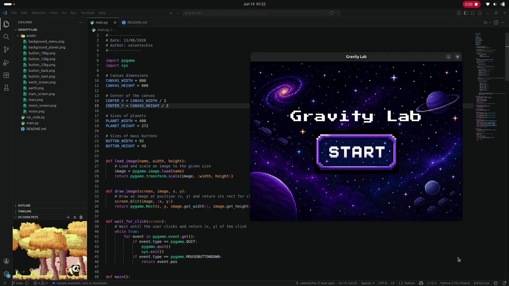

# Gravity Lab
> An interactive gravity simulator built with Python



## About

A small educational project created for Stanford's Code in Place program. Users can select a celestial body, choose a luggage mass, and compare how gravity affects its weight on Earth, Mars, and the Moon.

---

## Run it locally

```bash
# Clone repository
git clone https://github.com/valentechie/gravity-lab.git

# Enter project folder
cd gravity-lab

# Install pygame
pip install pygame  # or sudo apt install python3-pygame

# Run
python main.py
```
